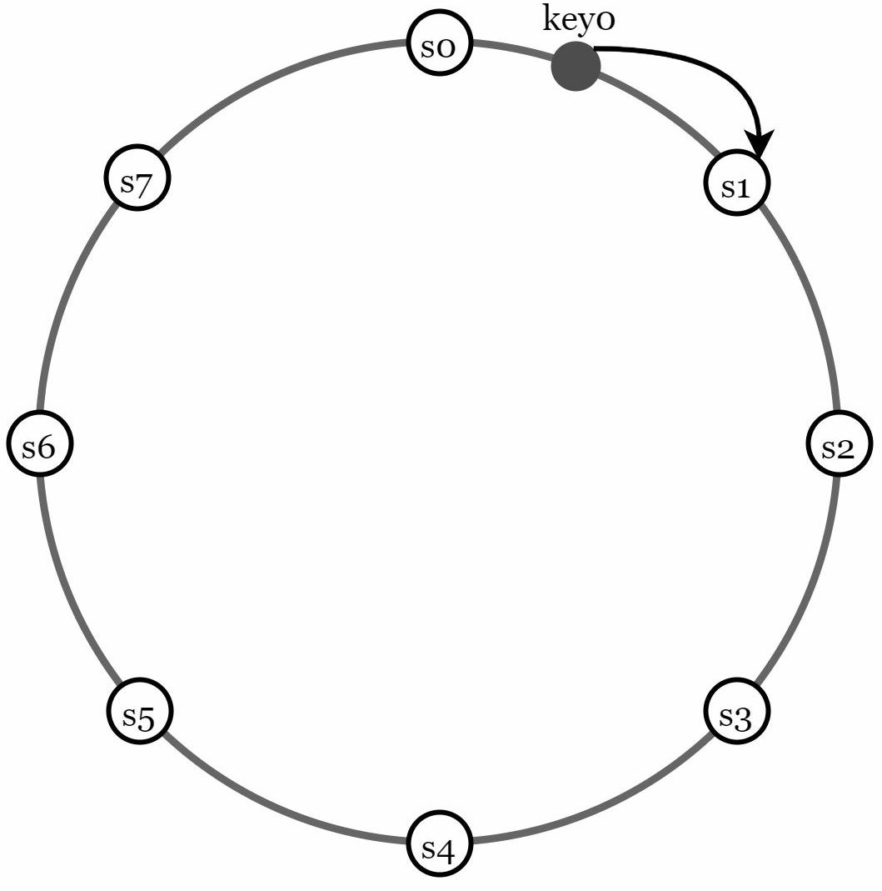
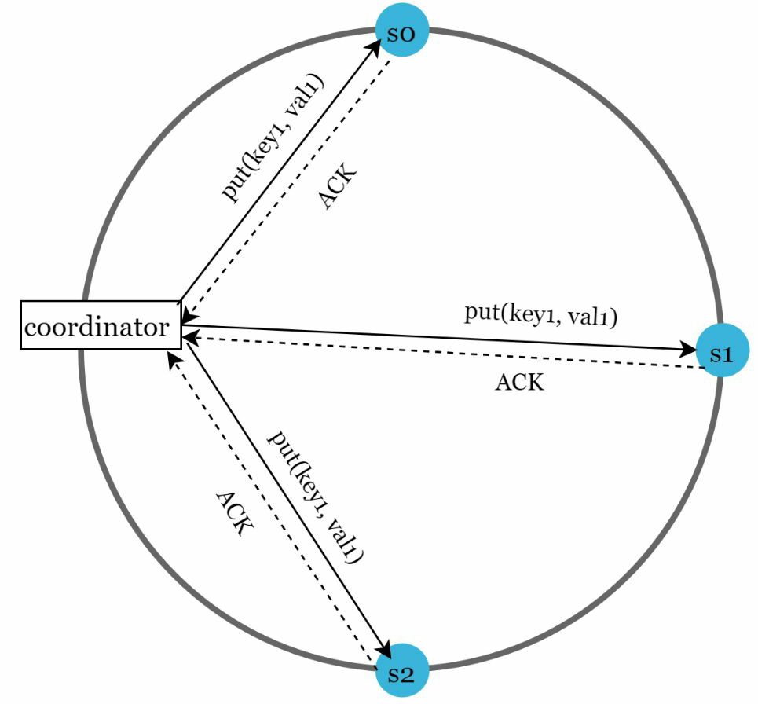
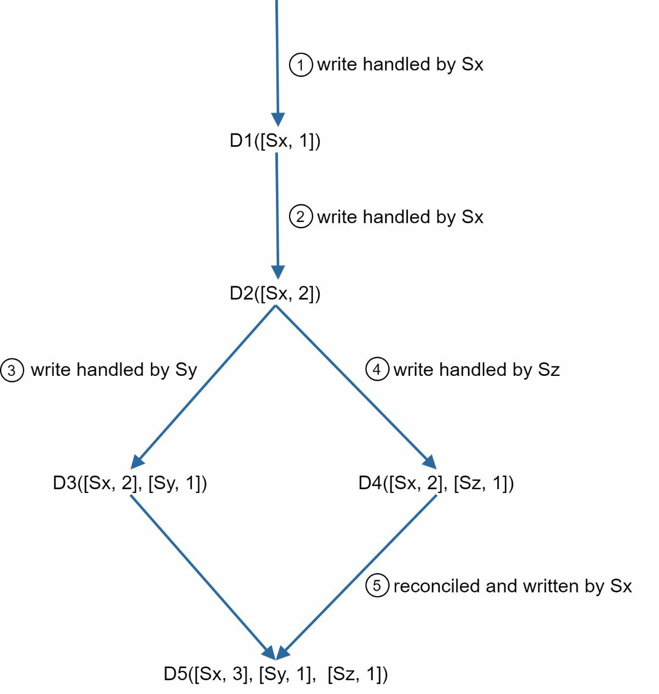
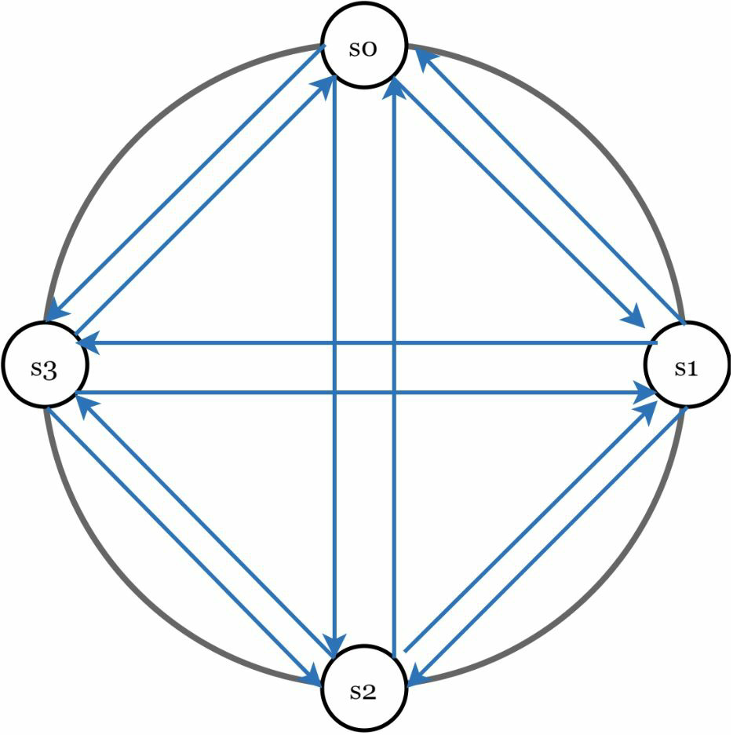
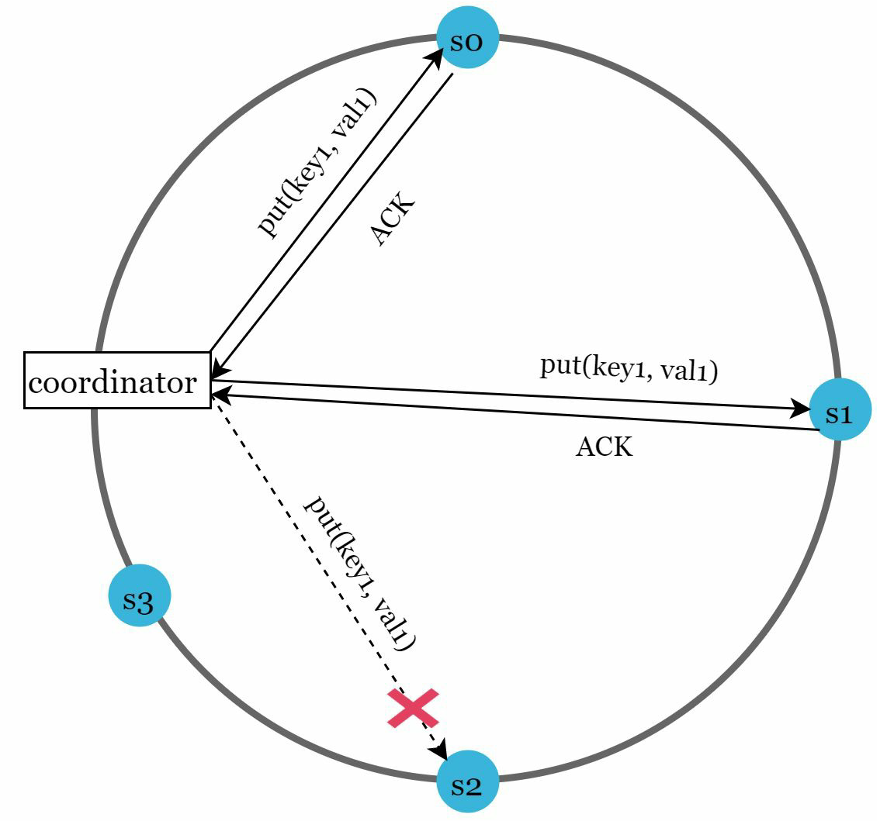
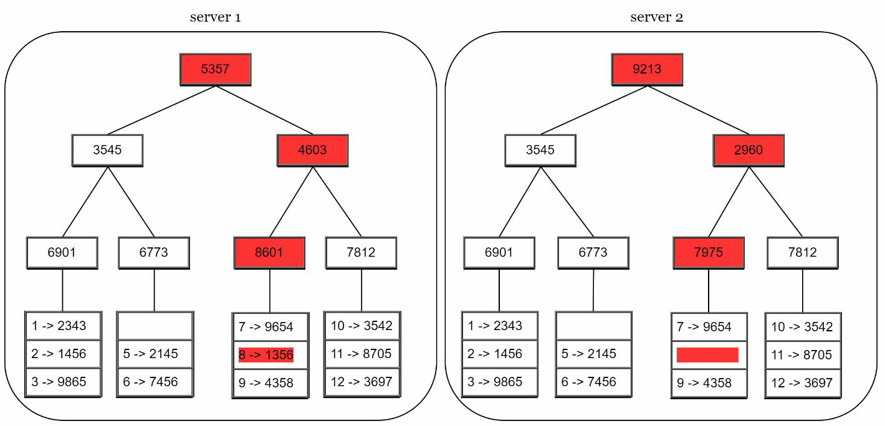

# Chapter 6: Design a Key-Value store
- Definition
  - A key-value store, also referred to as a key-value database, is a non-relational database.
  - Each unique identifier is stored as a key with iuts associated value.
  - This data pairing is known as a "key-value" pair.
- Features
  - The key 
    - Must be unique.
    - Can be plain text or hashed values
      - Plain text key: 'last_logged_in_at'
      - Hashed key: 253DDEC4
    - A short key works better for performance reaons
  - The value 
    - An be accessed through the key.
    - Strings, Lists, object, etc.
    - The value is usually treated as an opaque object in key-value stores, such as Amazon dynamo, Memcached, Redis, etc.
  


## Understand the problem and establish design scope
- No perfect design
- Each design achieves a specific balance regarding the tradeoffs
  - read/write/memory usage.
  - consistency & availability
- Design a key-value store that comprise of the following characteristics
  - The size of a key-value pair is small: less than 10KB
  - Ability to store big data
  - High Availability: The system response quickly, even during failures.
  - High Scalalbility: The system can be scaled to support large data set.
  - Automatic scaling: The addition/deletion of servers should be automatic based on traffic
  - Tunable consistency
  - Low latency

## Single server key-value store
- Developing a key-value store that resides in a single server is EASY
- Hash table
- Two optimizations can be done to fit more data in a single server
  - Data compression
  - Store only frequently used data in memory data and the rest on disk
- Even with these optimizations, a single server can reach its capacity very quickly.
- A distributed key-value store is required to support big data.

## Distributed key-value store
- Distributed hash table
- Distributes key-value pairs across many servers

### CAP theorem : It is impossible for a distributed system to simultaneously provide more than two of these three guarantees: consistency, availability and parition tolerance. 

  - Consistency 
    - all clients see the same data at the same time no matter which node they connect to
  - Availability
    - Any client which requests data gets a response even if some of the nodes are down
  - Partition Tolerance
    - Partition indicates a communication break between two nodes.
    - The system continues to operate despite network partition


Now datays, key-value store are classified based on the two CAP characteristic they support
#### CP(consistency and partitoin tolerance) systems
#### AP(availability and partition tolerance) system
#### CA(consistency and availability) system
- Sacrificing partition tolerance
- Network failure is unavoidable, a distributed system must tolerate network partition
- Thus, a CA system cannot exist in real-world application

### Example of distribute systems
- Data is usually replicated multiple times
- Assume data are replicatd on three replica nodes, n1, n2 and n3 as below image.

#### Ideal situation
- In the ideal world, netwokr partition never occurs.
- Data written to n1 is automatically replicated to n2 and n3
- Both consistency and availability are archieved.


#### Real-world distributed system
- Paritions cannot be avoided
- When a parition occurs, we must choose between consistency and availability
- Below images, n3 does down and cannot communicate with n1 and n2
- If clients write data to n1 or n2, data cannot be progagated to n3
- If data is writeen to n3 but not propagated to n1 and n2 yet, and n1 and n2 would have stale data.


- If CP is chosen (abandon availability)
  - Must block all write operations to n1 and n2 to avoid data inconsistency among these three servers, which makes the system unavailable
  - Bank system (extremely high consistent requirements)
- If AP is chosen (abandon consistency)
  - The system keeps accepting read
  - It might return stale data
  - n1 and n2 will keep accepting writes, and data will be synced to n3 when the network partition is resolved. 
- Choosing the right CAP guarantees that fit your use case is an important step in building a distributed key-value store. 

## System component : Core components and techniques used to build a key-value store
- Data parition
- Data replication
- Consistency
- Inconsistency resolution
- Handling failures
- System Architecture diagram
- Write Path
- Read Path

### Data partition
For large applications, it is infeasible to fit the complete data set in a single server. The simplest way to accomplish this is to split the data into smaller partitions and store them in multiple servers. There are two challenges while partitioning the data
- Distribute data across multiple servers evenly.
- Minimize data movement when node are added or removed
- Consistent hashing is a great technique to solve these problem.

- Using consistent hashing to partition data has the following advantages
  - Automatic scaling: servers could be added and removed automatically depending on the load
  - Heterogeneity: the number of virtual nodes for a server proportional to the server capacity. 

### Data replication
- To achieve high availability and reliability, data must be replicated asynchronously over N servers, where N is a configurable parameter. 
- These N servers are chosen using following logic
  - After a key is mapped to a position on the hash ring, walk clockwise from that position and choose the first N servers on the ring to store data copies. 
  - Below images, N=3, key0 is replicated at s1, s2 and s3

  - With virtual nodes, the first N nodes on the ring may be owned by fewer than N physical servers. To avoid this issue, we only choose unique servers while performing the clock wise walk logic.
  - Nodes in the same data center often fail at the same time due to power outages, a network issues, natural disasters, etc. For better reliability, replicas are placed in distinct data centers, and data centers are connected through high-spped networks.

### Consistency
- This is one of the distributed lock manager based concurrency control protocol in distributed database system.
- Since data is replicated at multiple nodes, it must be synchronized across replicas
- Quorum consensus can guarantee consistency for both read and write opertions

```
N = The number of replicas
W = A write quorum of size W. For a write operation to be considered as successful, write operation must be acknowledged from W replicas. 
R = A read quorum of size R. For a read operation to be considered as successful, read operation must wait for responses from at leat R replicas.
```

- W = 1 does not mean data is written on one server. Means the coordinator must receive at least one acknowledgement before the write operation is considered as successful. 
- The configuration of W, R, and N is a typical tradeoff between latency and consistency
  - W =1 or R=1, an operation is returned quickly because a coordinator only needs to wait for a reponse from any of replicas.
  - W or R > 1, then system offers better consistency
  - W + R > N, strong consistency is guaranteed because there must be at least one overlapping node that has the latest data to ensure consistency.
- Possible setups
  - If R = 1 and W = N, the system is optimzied for a fast read
  - If W = 1 and R = N, the system is optimized for fast write
  - If W + R > N, strong consistency is guaranteed
  - If W + R <= N, strong consistency is not guaranteed.

#### Consistency models
Consistency model is other important factor to consider when designing a key-value store. 
- Strong consistency
  - Any read operation returns a value corresponding to the result fo the most updated wrtie data tiem. A client never see out-of-date data
- Weak consistency
  - Subsequent read operations may not see the most updated value. 
- Eventual consistency
  - Specific from of weak consistency. 
  - Given enough time, all updates are progagated, and all prelicas are consisten

### Inconsistency resolution: versioning
- Replication gives high availablity but causes inconsistencies among replicas
- Versioning and vector locks are used to solve inconsistency problems
- Versioning
  - treating each data modifications as a new immutable version of data.


- Both replica nodes n1 and n2 have the same data


- Server1 changes the name to "johnSanFancisco"
- Server2 changes the name to "johnNewYork"
- These two changes are performed simultaneously.

#### Consideration
- The original value could be ignored because the modifications where basd on it.
- However, there is no clear way to resolve the conflict or the last two versions. 
- To resolve this issue, we need a versioning system that can detect conflicts and reconcile conflict.
- A vector clock is a common technique to solve this problem

#### Vector clock
- [server, version] pair asscoiated with a data item
- It can be used to check if one version precedes, succeeds, or in conflict with others
- Assumtion
  - A vector lock is represented by D([s1,v1], [s2,v2], ...,[sn,vn]), where D is a data item
  - v1 is a version counter
  - s1 is server number
  - If data item D is written to server Si, the system must perform one of the following taks
    - Increment vi if [Si, vi] exists
    - Otherwise, create a new entry [Si, 1]


- How it works?
  - A client writes a data item D1, handled by Sx, then has the vector lock D1[(Sx, 1)]
  - A client writes a data item D2(update D1), handled by Sx, then has the vector lock D2[(Sx, 2)]
  - Simultaneously, a client writes a data item D3(update D2), handled by Sy, then has the vector lock D3[(Sx, 2), (Sy, 1)]
  - Simultaneously, a client writes a data item D4(update D2), handled by Sz, then has the vector lock D2[(Sx, 2), (Sz, 1)]
  - When client read D3, D4, it discovers a conflict, which is caused by data item D2 being modified by both Sy, Sz. The conflict is resolved by the client and updated data is sent to the server

- How to resolve conflict?
  - Let X is ancestor of Y
  - No conflict
    - if the version counters for each participant in the vector clock of Y is greater than or equal to the ones in the X
    - exmaple: D([s0, 1], [s1, 1]) is an ancestor of D([s0, 1], [s1, 2])
  - conflict
    - if there is any participant in Y's vector clock who has a counter that is less than its corresponding counter in X
    - example: D([s0, 1], [s1, 2]) , D([s0, 2], [s1, 1])
- Even though vector clocks can resolve conflicts, there are two notable downsides
  - vector clocks add complexity to the client, for implementing conflict resolution logic
  - [server:version] pairs in the vector clock could grow rapidly

### Handling failures
- As with any large system at scal,e failures are not only inevitable but common.

#### Failure detection
- In a distributed system(DS), it is insufficient to believe that a server is down because another server says so.
- Usually, it requires at least two independent sources of information to make a server down
- Just many servers on system is inefficient like below images



- A better solution
  - to use decentralized failure detection method like gossip protocol
- Gossip protocol
  - Each node maintains a node membership list, which contains member IDs and heartbeat counters.
  - Each node periodically increments its heartbeat counter.
  - Each node periodically sends heartbeats to a set of random nodes, which in turn progagate to another set of nodes.
  - Once nodes receive heartbeats, membership list is updated to the latest info.
  - If the heartbeat has not increased for more than predefined period, the member is considered as offline

- Example
  - NOde s0 maintinas a node membership list shown on the left side
  - Node s0 notices that nodes s2's heartbeat counter has not increased for a long time
  - Node s0 sends heartbeats that includes s2's info to a set of random nodes. Once other confirm that, nodes s2 is mared down, and this info is propagated to other nodes.

#### Handling temporary failures
- After failure is detected through the gossip protocol, system needs to deploy certain mechanisms to ensure availability.
- sloppy quorum
  - used to improve availability
  - Instead of enforcing the quorum requirement, the system chooses the first W healthy servers for writes and first R healthy servers for reads on the hash ring. Offline servers are ignored


#### Handling permanent failures
- Hinted handoff is used to handle temporary failures.
- What if a replica is permanently unavailable?
- To handle such a situation, anti-entropy protocol to keep replicas in sync
- Anti-entrophy
  - Comparing each piece of data on replicas and updating each replica to the newest version
  - A Merkle tree is used for inconsistency detection and minimizing the amount of data transferred
  - Merkle tree(hash tree)
    - A tree in which every non-leaf node is labeled with the hash of the labels or values (in case of leaves) of its child nodes. 

##### Step 1
- Divide key space in to buckets  
- A bucket is used as the root level node to maintain a limited depth of the tree


##### Step 2
- Once the buckets are created, hash each key in a bucket using a uniform hashing method


##### Step 3
- Create a single hash node per bucket


##### Step 4
- Build the tree upwards till root by calculating hashes of children


- To compare two Merkle trees, start by comparing the root hashes
- Find out the mismatch values through travel from root node.
- Using merkle trees, the amount of data needed to be synchronized is proportional to the differences between the two replicas, and not the amount of data they contain. In real-world systems, the bucket size is quite big.

#### Handling data center outage
- Data center outage could happen due to power outage, network outage, natural disaster, etc.
- To build a system capable of handling data center outage, it is important to replicate data across multiple data centers.

### System architecture diagram

- Main features of the architecture are listed as follows
  - Clients communicate with the key-value store through simple APIs: get / put
  - A coordinate is a node that acts as a proxy between the client and the key-value store
  - Nodes are distributed on a ring using consistent hashing
  - The system is completely decentralized so adding and moving nodes can be automatic
  - Data is replicated at multiple nodes
  - There is no SPOF, every node has the same set of responsibilites.


### Write Path

- What happens after a write request is directed to a specific node
  - The write request is persisted ona commit log file
  - Data is saved in the memory cache
  - When the memory cache is full or reaches a predefined threshold, data is flushed to SSTable on disk
    - A sorted-string table(SSTable) is sorted list of <key, value> paris

### Read Path
- Workflow of Read
  - First checks fi data is in the memory cache
  - If so, the data is returned to the client

  - If not, it will be retrieved from the disk instead.
  - We need an efficient way to find out which SSTable contains the key
  - Bloom filter is commonly used to solve this problem
    - The bloom filter is used to figure out which SSTable might contain the key
    - SSTable return the result of the data
  - The result of the data set is returned to the client


## Summary
