### CHAPTER 6: DESIGN A KEY-VALUE STORE

A key-value store, also referred to as a key-value database, is a non-relational database. Each unique identifier is stored as a key with its associated value.

#### Problem and Design Scope
• The size of a key-value pair is small: less than 10 KB.
• Ability to store big data.
• High availability: The system responds quickly, even during failures.
• High scalability: The system can be scaled to support large data set.
• Automatic scaling: The addition/deletion of servers should be automatic based on traffic.
• Tunable consistency.
• Low latency.

#### Single server key-value store
Hash table, which keeps everything in memory
• Data compression
• Store only frequently used data in memory and the rest on disk
!!! Capacitiy is problem when the size of the data grows

#### Distributed key-value store
A distributed key-value store is also called a distributed hash table

#### CAP theorem
CAP theorem states it is impossible for a distributed system to simultaneously provide more than two of these three guarantees: consistency, availability, and partition tolerance.
- Consistency: consistency means all clients see the same data at the same time no matter
which node they connect to.
- Availability: availability means any client which requests data gets a response even if some
of the nodes are down.
- Partition Tolerance: a partition indicates a communication break between two nodes.
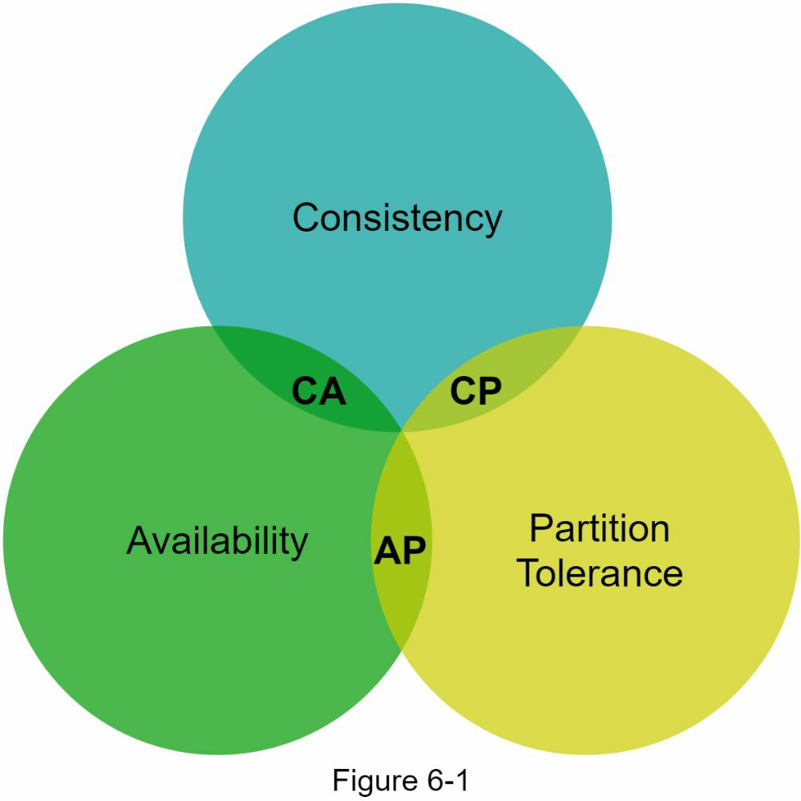
#### Ideal situation
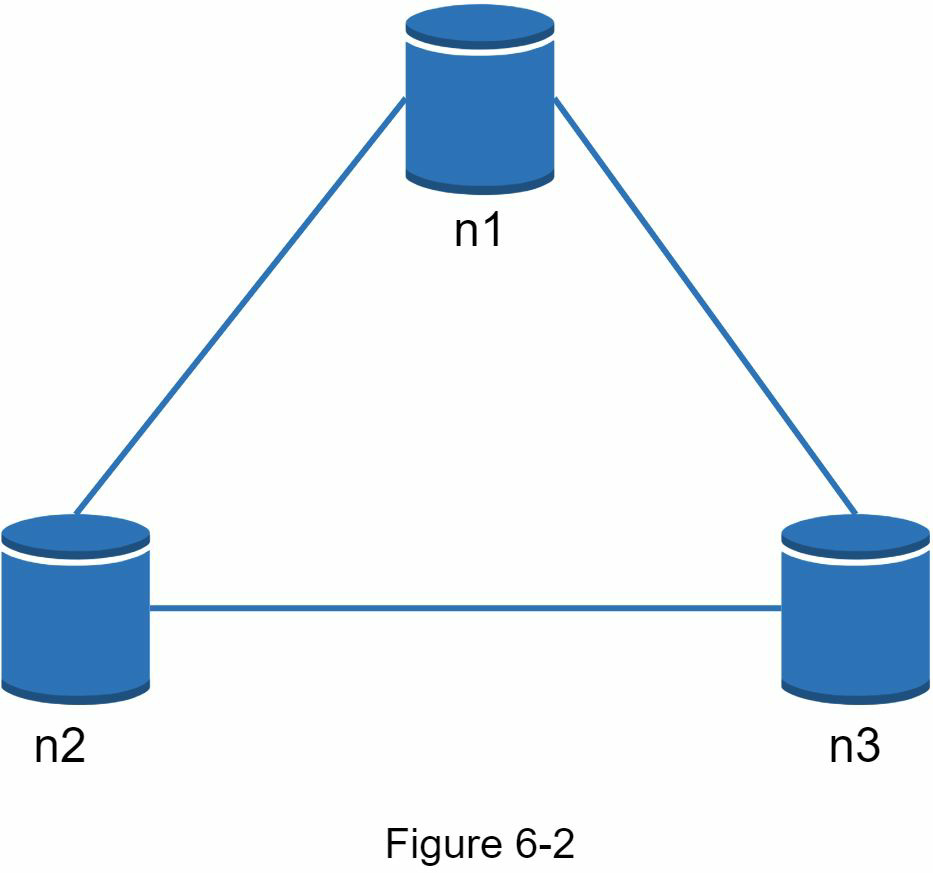
#### Real-world distributed systems

In case that n3 is down,
- If we choose Consistency (CP): block all write operations to n1 and n2 to avoid data inconsistency among these three servers, which makes the system unavailable e.g., Bank System
- If we choose availability (AP) : the system keeps accepting reads, even though it might return stale data. For writes, n1 and n2 will keep accepting writes,and data will be synced to n3 when the network partition is resolved.

Choosing the right CAP guarantees that fit your use case is an important step in building a
distributed key-value store. You can discuss this with your interviewer and design the system
accordingly.

System components
• Data partition
• Data replication
• Consistency
• Inconsistency resolution
• Handling failures
• System architecture diagram
• Write path
• Read path

#### Data Partition
Two challenges below -> Consistent Hashing
• Distribute data across multiple servers evenly.
• Minimize data movement when nodes are added or removed.
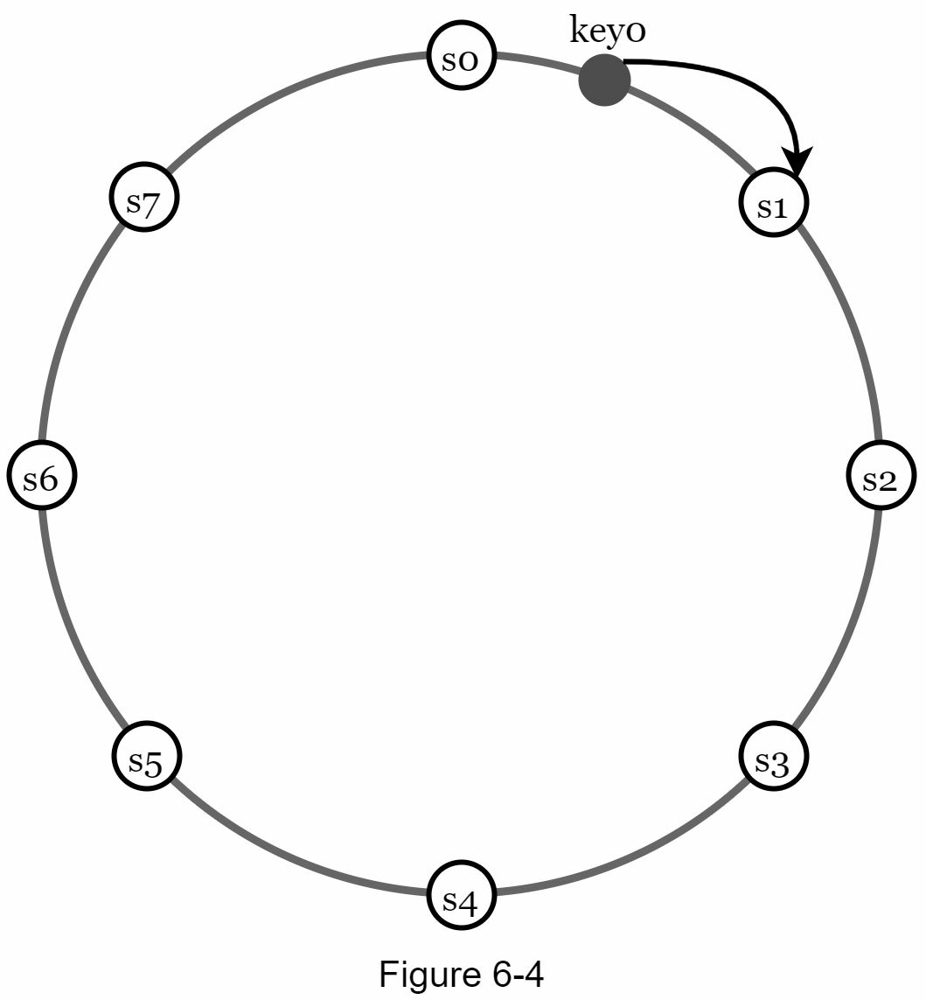

#### Data replication
Use Hash ring + clockwise walk + unique servers instead of virtual node + data center seperation(reliability)
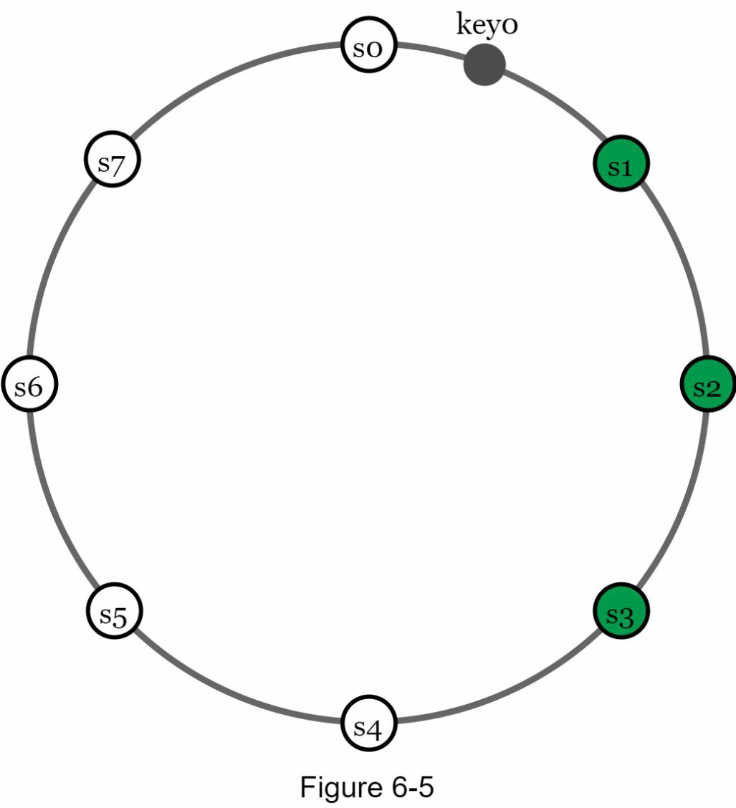

#### Consistency
N = The number of replicas
W = A write quorum of size W. For a write operation to be considered as successful, write
operation must be acknowledged from W replicas.
R = A read quorum of size R. For a read operation to be considered
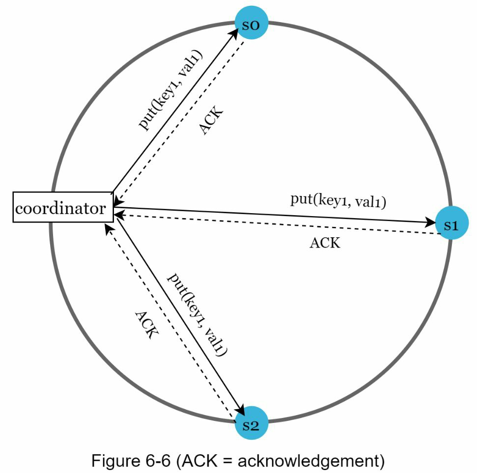
W = 1 does not mean data is written on one server. It means that the coordinator must receive at least one acknowledgment before the write operation is considered as successful.

The configuration of W, R and N is a typical tradeoff between latency and consistency

If R = 1 and W = N, the system is optimized for a fast read.
If W = 1 and R = N, the system is optimized for fast write.
If W + R > N, strong consistency is guaranteed (Usually N = 3, W = R = 2).
If W + R <= N, strong consistency is not guaranteed.

##### Consistency models
A
consistency model defines the degree of data consistency, and a wide spectrum of possible consistency models exist:

• Strong consistency: any read operation returns a value corresponding to the result of the most updated write data item. A client never sees out-of-date data.
• Weak consistency: subsequent read operations may not see the most updated value.
• Eventual consistency: this is a specific form of weak consistency. Given enough time, all updates are propagated, and all replicas are consistent.

#### Inconsistency resolution: versioning
Versioning and vector locks are used to solve inconsistency problems. Versioning means treating each data modification as a new immutable version of data.

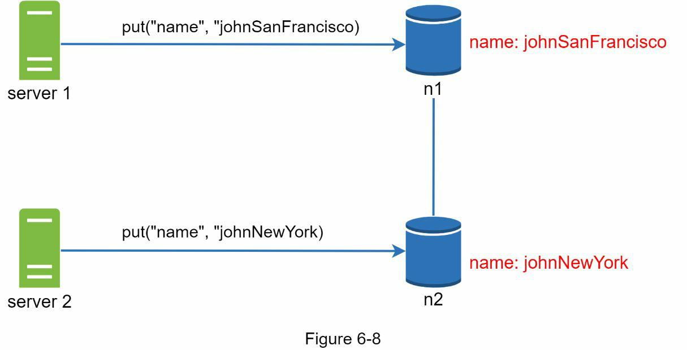
These two changes are performed simultaneously.
Now, we have conflicting values, called versions v1 and v2.

To resolve this issue, we need a versioning system that can detect conflicts and reconcile conflicts. A vector clock is a common technique to solve this problem.

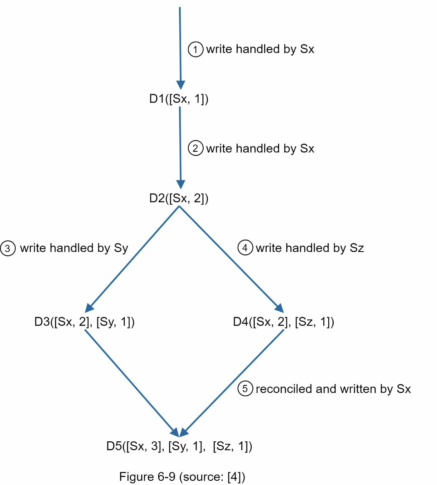

- No Conflict: it is easy to tell that a version X is an ancestor (i.e. no conflict) of version Y if the version counters for each participant in the vector clock of Y is greater than or equal to the ones in version X
D([s0, 1], [s1, 1]) is an ancestor of D([s0, 1], [s1, 2])

- Conflict : you can tell that a version X is a sibling (i.e., a conflict exists) of Y if there is any participant in Y's vector clock who has a counter that is less than its corresponding counter in X.
D([s0, 1], [s1, 2]) and D([s0, 2], [s1, 1]).

Downside of vector clock
1. Added complexity to the client for conflict resolution logic
2. The [server: version] pairs in the vector clock could grow rapidly. 
    - solution: set a threshold for the length, and if it exceeds the limit, the oldest pairs are removed

#### Handling failures

##### Failure detection
- All-to-all multicasting is a straightforward solution: Inefficient
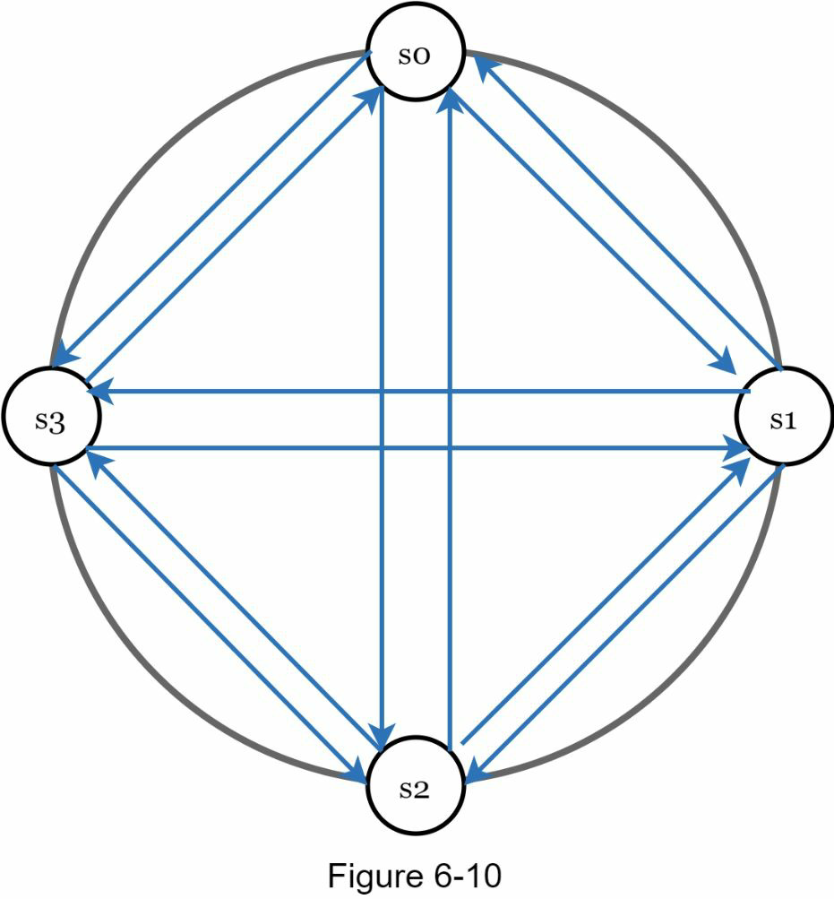

- Gossip protocol
Update Multicasted Heart beats on the Membership list. And check if the heart beats are not updated for a certain period of time, and propagate its failure
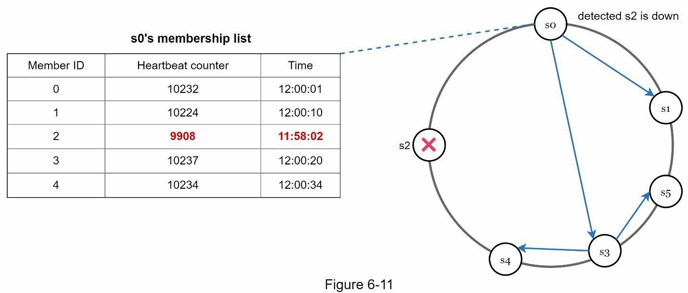

##### Handling temporary failures
- Sloppy quorum (Temporary): chooses the first W healthy servers for writes and first R healthy servers for reads on the hash ring. Offline servers are ignored. If a server is unavailable due to network or server failures, another server will process requests temporarily. When the down server is up, changes will be pushed back to achieve data consistency. This process is called hinted handoff.

- Anti-entrophy(Permanent Down) : Anti-entropy involves comparing each piece of data on replicas and updating
each replica to the newest version. A Merkle tree is used for inconsistency detection and
minimizing the amount of data transferred.

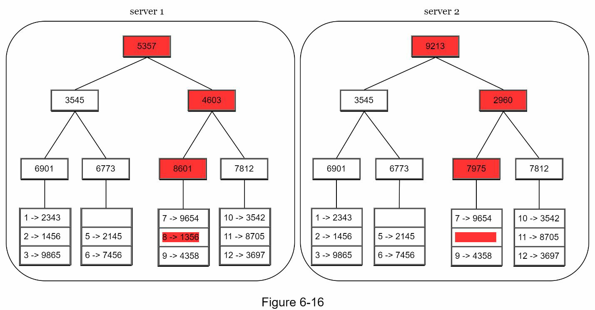

##### Hash function
A hash function is any function that can be used to map data of arbitrary size to fixed-size values, though there are some hash functions that support variable length output

Same key -> Hash function -> Same Hashcode (Reverse is not always work)

##### Handling data center outage

Main features of the architecture are listed as follows:
• Clients communicate with the key-value store through simple APIs: get(key) and put(key,
value).
• A coordinator is a node that acts as a proxy between the client and the key-value store.
• Nodes are distributed on a ring using consistent hashing.
• The system is completely decentralized so adding and moving nodes can be automatic.
• Data is replicated at multiple nodes.
• There is no single point of failure as every node has the same set of responsibilities.

#### Write path
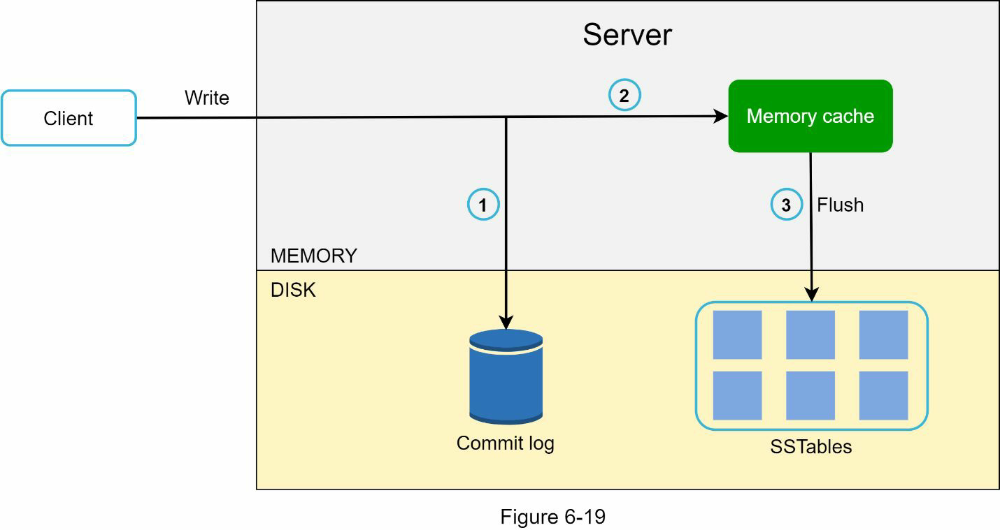

#### Read path
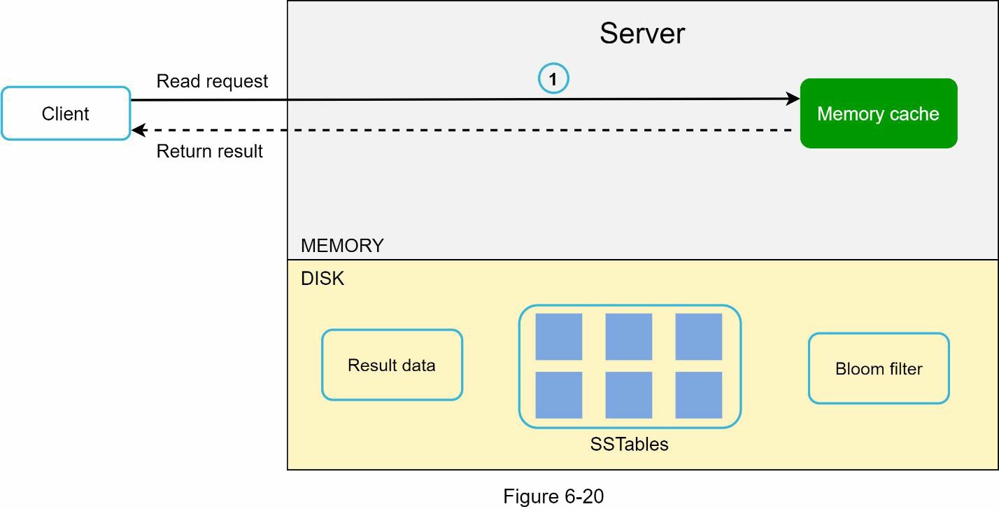
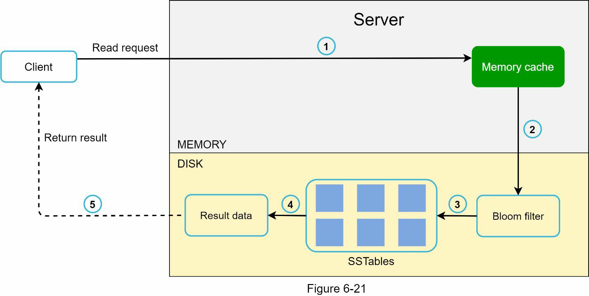

#### Summary
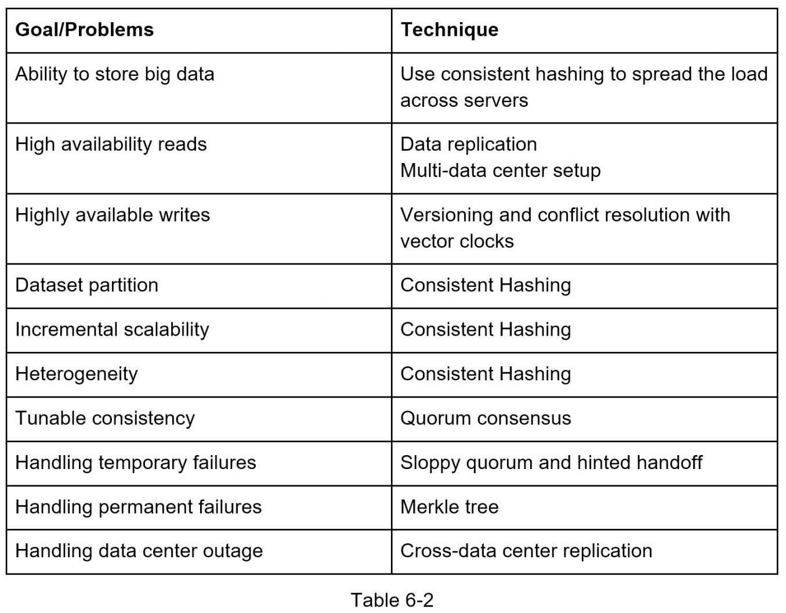