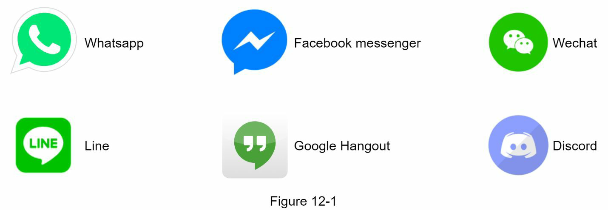
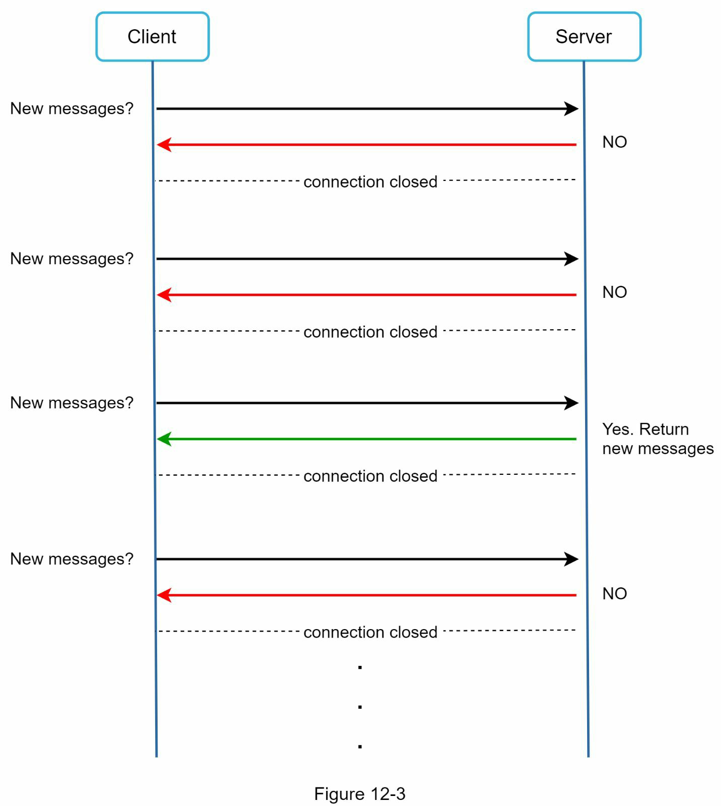
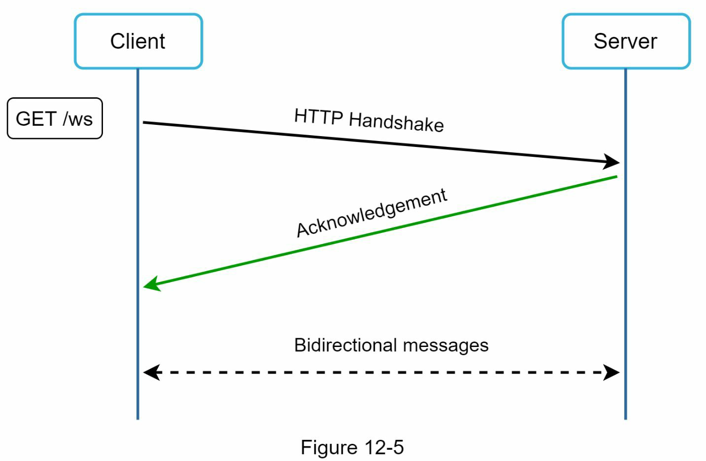
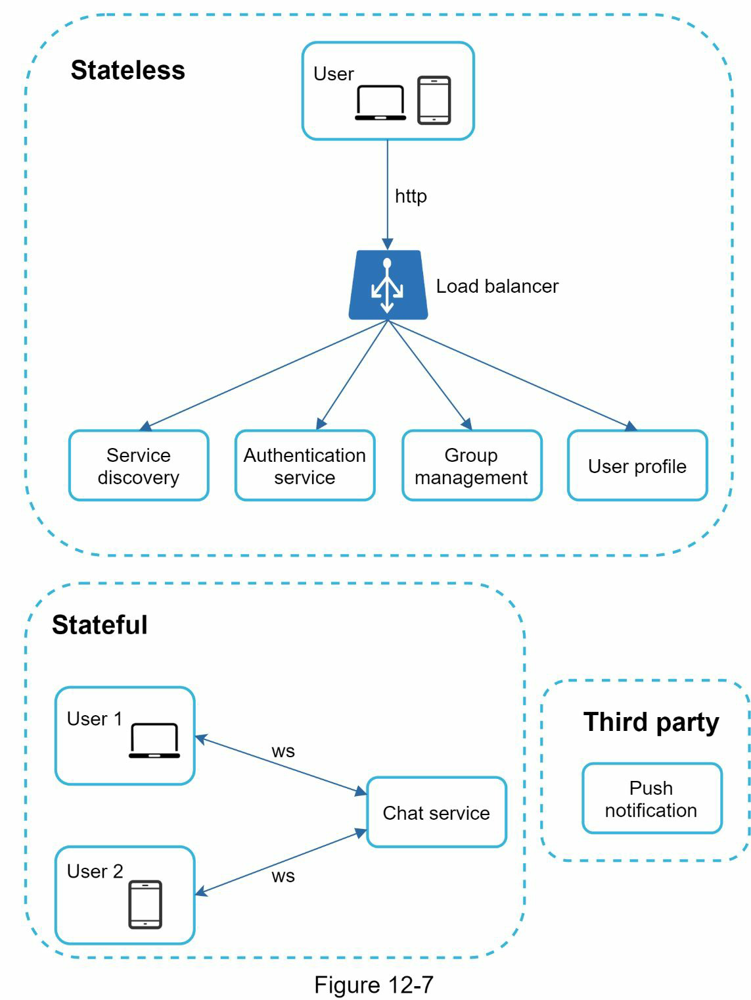
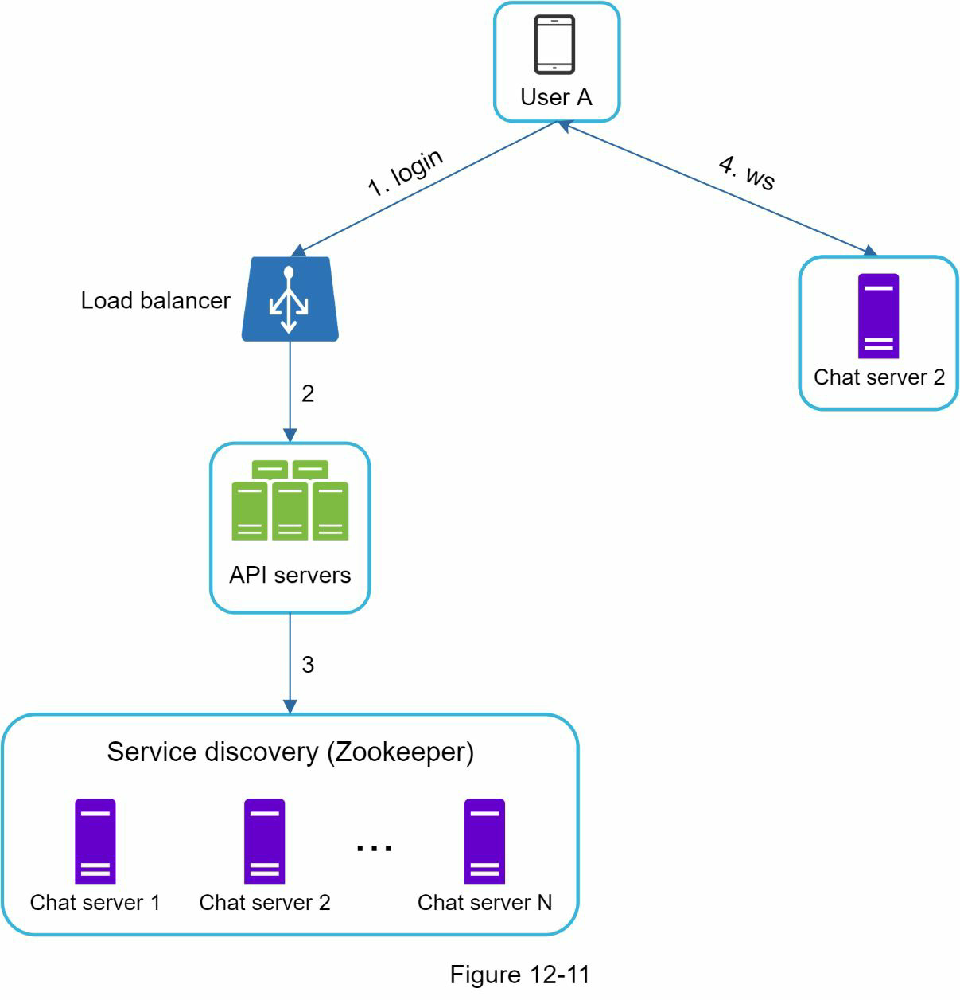
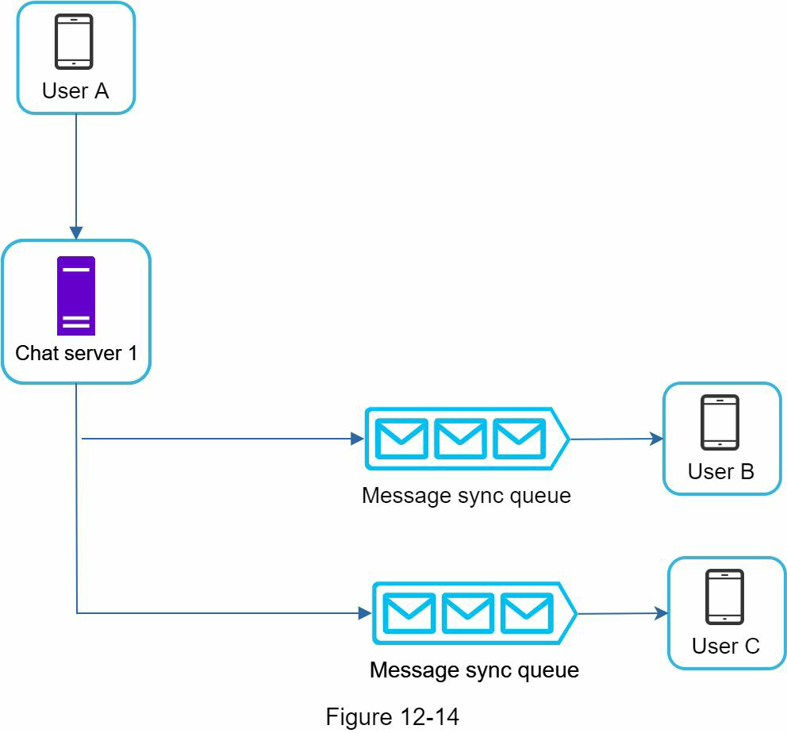
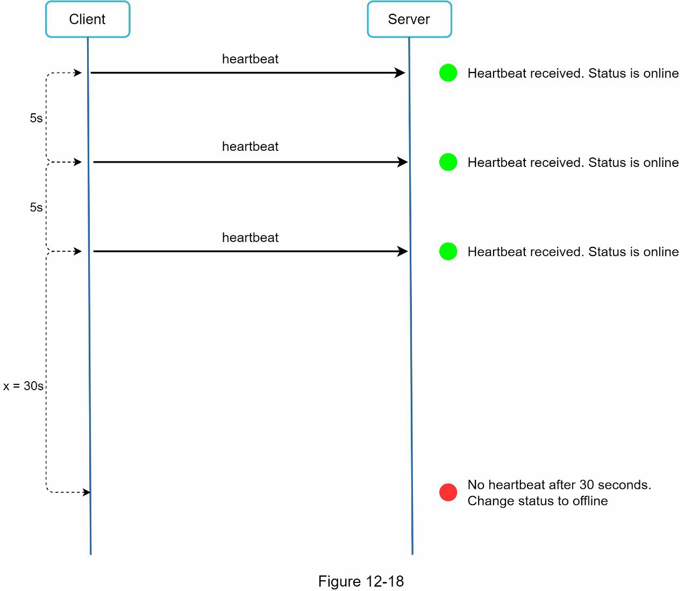

# CHAPTER 12: DESIGN A CHAT SYSTEM

<table align="center">
  <tr>
    <td></td>
    <td><strong>Global Relay Message</strong></td>
  </tr>
</table>

## Step 1 - Understand the problem and establish design scope

one-on-one: Facebook Messenger, WhatsApp
office chat: Slack
game chat: Discord large group interaction
and low voice chat latency
Global Relay Message: one-on-one & office chat

Candidate: What kind of chat app shall we design? **1 on 1 or group based?**\
Interviewer: It should support **both 1 on 1 and group chat**.\
Candidate: Is this a **mobile app? Or a web app? Or both?** (Desktop app)\
Interviewer: Both.\
Candidate: What is the **scale** of this app? A startup app or massive scale?\
Interviewer: It should support **50 million daily active users (DAU)**.\
Candidate: For group chat, what is the **group member limit**?\
Interviewer: **A maximum of 100 people**\
Candidate: **What features are important** for the chat app? Can it support attachment?\
Interviewer: **1 on 1 chat, group chat, online indicator(presence). The system only supports text
messages.**\
Candidate: Is there a **message size limit**?\
Interviewer: Yes, text length should be **less than 100,000 characters long**.\
Candidate: Is **end-to-end encryption** required?\
Interviewer: Not required for now but we will discuss that if time allows.\
Candidate: **How long shall we store the chat history**?\
Interviewer: Forever.

features:
- A one-on-one chat with low delivery latency
- Small group chat (max of 100 people)
- Online presence
- Multiple device support. The same account can be logged in to multiple accounts at the same time.
- Push notifications

system that supports 50 million DAU.

## Step 2 - Propose high-level design and get buy-in
we should have a basic knowledge of how clients and
servers communicate: clients can be either mobile applications or web applications. Clients do not communicate directly with each other. Instead, each client connects to a chat service

The chat service must support the following functions:
- Receive messages from other clients.
- Find the right recipients for each message and relay the message to the recipients.
- If a recipient is not online, hold the messages for that recipient on the server until she is online.

the relationships between clients (sender and receiver) and the chat service

When a client intends to start a chat, it connects the chats service using one or more network
protocols (uses the time-teste HTTP protocol). For a chat service, **the choice of network protocols is important**.
The client opens a HTTP connection with the chat service and sends the message, informing the service to send the message to the receiver. The **keep-alive** header allows a client to maintain a persistent connection with the chat service. It also reduces the number of **TCP handshakes**.

Since HTTP is client-initiated, it is not trivial to send messages from the server.
server-initiated connection: polling, long polling, and WebSocket

### Polling
polling is a technique that the client **periodically asks the server if there are messages available**. Depending on polling frequency, polling could be costly. It could consume precious server resources to answer a question no as an answer most of the time.

### Long polling

Client holds the connection open until there are actually new messages available or a timeout threshold has been reached. Once the client receives new messages, it immediately sends another request to the server, restarting the process.

drawbacks:
- Sender and receiver may not connect to the same chat server. HTTP based servers are usually stateless. If you use round robin for load balancing, the server that receives the message might not have a long-polling connection with the client who receives the message.
- A server has no good way to tell if a client is disconnected.
- It is inefficient. If a user does not chat much, long polling still makes periodic connections after timeouts.

### WebSocket
Sending asynchronous updates from server to client

- WebSocket connection is initiated by the client. 
- It is **bi-directional** and **persistent**. 
- It starts its life as a HTTP connection and could be “upgraded” via some well-defined handshake to a WebSocket connection. 
- WebSocket connections generally work even if a firewall is in place. This is because they use port 80 or 443 which are also used by HTTP/HTTPS connections. Firewalls typically allow traffic on these ports.

Bidirectional: the server and client can send data to each other at any time, making it more suitable for real-time applications

How WebSockets is used for both sender and receiver sides:

Since WebSocket connections are persistent, efficient connection management is critical on the server-side.

### High-level design

most features (sign up, login, user profile, etc) of a chat application could use the traditional request/response method over HTTP. (not everything else should use WebSocket)

Chat system is broken down into three major categories:\
stateless services, stateful services, and third-party integration.

#### Stateless Services
traditional public-facing request/response services, used to manage the login, signup, user profile, etc.

load balancer: to route requests to the correct services based on the request paths.\
service discovery: to give the client a list of DNS host names of chat servers that the client could connect to.

#### Stateful Service
Chat service is stateful because each client maintains a persistent network connection to a chat server. A client normally does not switch to another chat server as long as the server is still available.

#### Third-party integration
Push notification. Refer to *Chapter 10 Design a notification system*

#### Scalability
the scale we design for, it is in theory possible to fit all user connections in one modern cloud server.
At 1M concurrent users, assuming each user connection needs 10K of memory on the server it only needs about 10GB of memory to hold all the connections on one box.

Please don't propose a design where everything fits in **one server**, this may raise a big red flag in the
interviewer’s mind.

However, it is perfectly fine to **start with** a single server design (Just a starting point).

the client maintains a persistent WebSocket connection to a chat server for real-time messaging.
- Chat servers facilitate message sending/receiving.
- Presence servers manage online/offline status.
- API servers handle everything including user login, signup, change profile, etc.
- Notification servers send push notifications.
- Finally, the key-value store is used to store chat history. When an offline user comes
online, she will see all her previous chat history.

#### Storage
Two types of data exist in a typical chat system. The first is **generic data**, such as user profile,
setting, user friends list. These data are stored in relational databases.
(Replication and sharding)

The second: chat history data: It is important to understand the read/write pattern.
- The amount of data is enormous for chat systems.\
Facebook messenger and Whatsapp process 60 billion messages a day.
- Only recent chats are accessed frequently. Users do not usually look up for old chats.
- Although very recent chat history is viewed in most cases, users might use features that require random access of data, such as search, view your mentions, jump to specific messages, etc. These cases should be supported by the data access layer.
- The read to write ratio is about 1:1 for 1 on 1 chat apps.

To use key-value stores for the following reasons:
- they allow easy horizontal scaling.
- they provide very low latency to access data.
- Relational databases do not handle long tail of data well. When the indexes grow large, random access is expensive.
- they are adopted by other proven reliable chat applications. (ex: both Facebook messenger, Discord)

### Data models
message data.

#### Message table for 1 on 1 chat

The primary key is `message_id`, *which helps to decide message sequence*. We cannot rely on `created_at` to decide the message sequence because two messages can be created at the same time.

#### Message ID
Message_id carries the responsibility of ensuring the order of messages
1. IDs must be unique.
2. IDs should be sortable by time, meaning new rows have higher IDs than old ones.

Local sequence number generator:
- IDs are only unique **within a group** (Locally). 
- Maintaining message sequence within one-on-one channel or a group channel is sufficient. 
- Easier to implement in comparison to the global ID implementation.

## Step 3 - Design deep dive
For the chat system, service discovery, messaging
flows, and online/offline indicators worth deeper exploration.

### Service discovery
Service discovery is to recommend the best chat server for a client based on the criteria like geographical location, server capacity, etc.\
Apache Zookeeper registers all the available chat servers and picks the best chat server for a client based on predefined criteria.

1. User A tries to log in to the app.
2. The load balancer sends the login request to API servers.
3. After the backend authenticates the user, service discovery finds the best chat server forUser A. In this example, server 2 is chosen and the server info is returned back to User A.
4. User A connects to chat server 2 through WebSocket.

### Message flows
end-to-end flow of a chat system.

#### 1 on 1 chat flow
Use A send message to user B

1. User A sends a chat message to Chat server 1.
2. Chat server 1 obtains a message ID from the ID generator.
3. Chat server 1 sends the message to the message sync queue.
4. The message is stored in a key-value store.
5. 
- If User B is online, the message is forwarded to Chat server 2 where User B is connected.
- If User B is offline, a push notification is sent from push notification (PN) servers.
6. Chat server 2 forwards the message to User B. There is a persistent WebSocket connection between User B and Chat server 2.

#### Message synchronization across multiple devices
how to sync messages across multiple devices.

When User A logs in to the chat app with her phone, it establishes a WebSocket connection with Chat server 1. Similarly, there is a connection between the laptop and Chat server 1.

Each device maintains a variable called `cur_max_message_id`, which keeps track of the latest message ID on the device. Messages that satisfy the following two conditions are considered as news messages:
1. The recipient ID is equal to the currently logged-in user ID.
2. Message ID in the key-value store is larger than `cur_max_message_id`.

#### Small group chat flow

First, the message from User A is copied to each group member’s message sync queue: one for User B and the second for User C. You can think of the message sync queue as an inbox for a recipient. This design choice is good for **small group chat** because:
- it simplifies message sync flow as each client only needs to check its own inbox to get new messages.
- when the group number is small, storing a copy in each recipient’s inbox is not too expensive.

On the recipient side, a recipient can receive messages from multiple users. Each recipient has an inbox (message sync queue) which contains messages from different senders.

### Online presence
presence servers are responsible for managing online status and communicating with clients through WebSocket.

#### User login
After a WebSocket connection is built between the client and the real-time service, user A’s online status and `last_active_at` timestamp are saved in the KV store. Presence indicator shows the user is online.

#### User logout
When a user logs out, the online status is changed to offline in the KV store. The presence indicator shows a user is offline.

#### User disconnection
It is common for users to disconnect and reconnect to the internet frequently in a short time. Updating online status on every disconnect/reconnect would make the presence indicator change too often, resulting in poor user experience. Periodically, an online client sends a heartbeat event to presence servers. If presence servers receive a heartbeat event within a certain time, a user is considered as online. Otherwise, it is offline.

The client sends a heartbeat event to the server every 5 seconds. After sending 3 heartbeat events, the client is disconnected and does not reconnect within x = 30 seconds. The online status is changed to offline.

#### Online status fanout
Presence servers use a publish-subscribe model, in which each friend pair maintains a channel. When User A’s online status changes, it publishes the event to three channels, channel A-B, A-C, and A-D. Those three channels are subscribed by User B, C, and D, respectively. Thus, it is easy for friends to get online status updates. The communication between clients and servers is through real-time WebSocket.

For larger groups, informing all members about online status is expensive and time consuming. Assume a group has 100,000 members. Each status change will generate 100,000 events. A possible solution is to fetch online status only when a user enters a group or manually refreshes the friend list.\
*\*granular presence: subscribed users & on demand(scrolling)*

## Step 4 - Wrap up
- Extend the chat app to **support media files**. Media files are significantly larger than text in size. **Compression, cloud storage, and thumbnails** are interesting topics to talk about.
- End-to-end encryption. Whatsapp supports end-to-end encryption for messages. Only the sender and the recipient can read messages.
- Caching messages on the client-side is effective to reduce the data transfer between the client and server.
- Improve load time. Slack built a geographically distributed network to cache users’ data, channels, etc. for better load time.
- Error handling.
- The chat server error. There might be hundreds of thousands, or even more persistent connections to a chat server. If a chat server goes offline, service discovery (Zookeeper) will provide a new chat server for clients to establish new connections with.
- Message resent mechanism. Retry and queueing are common techniques for resending messages.