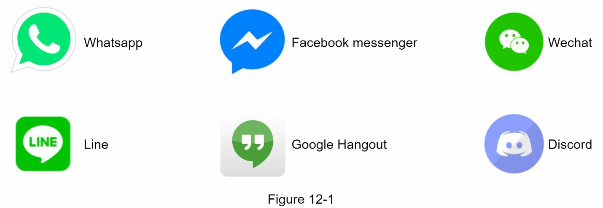
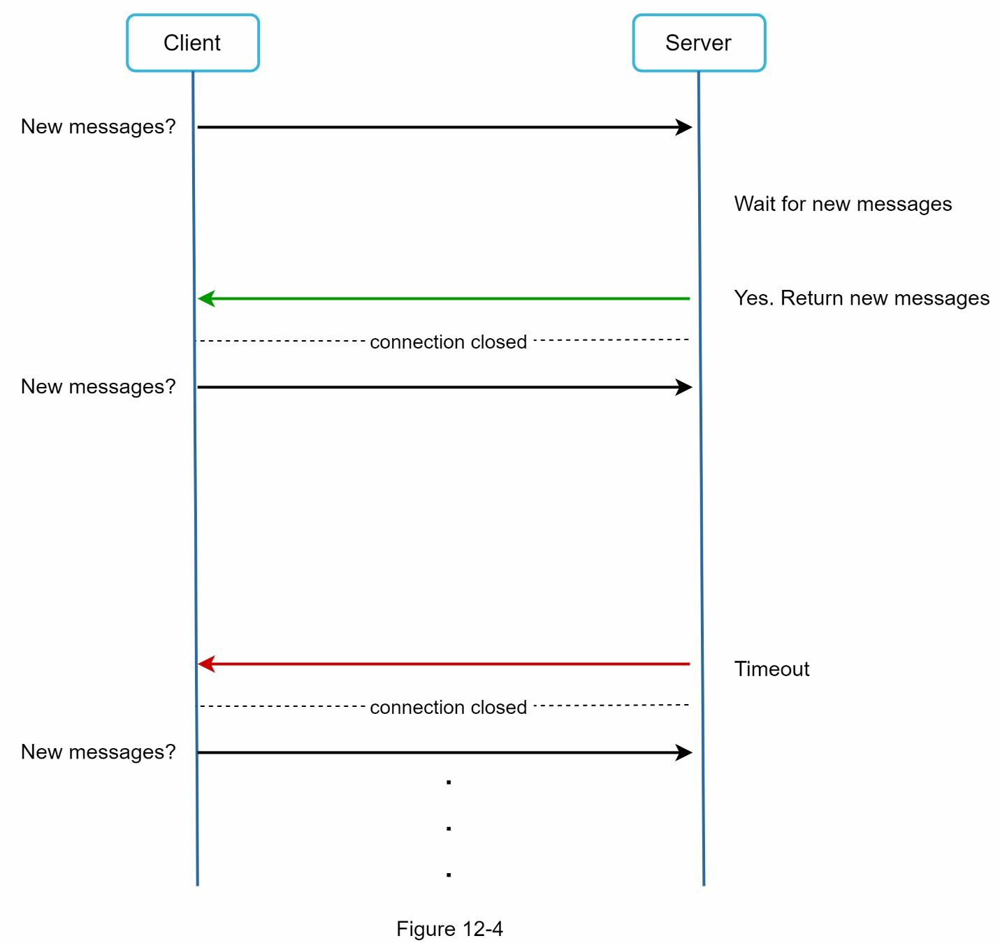
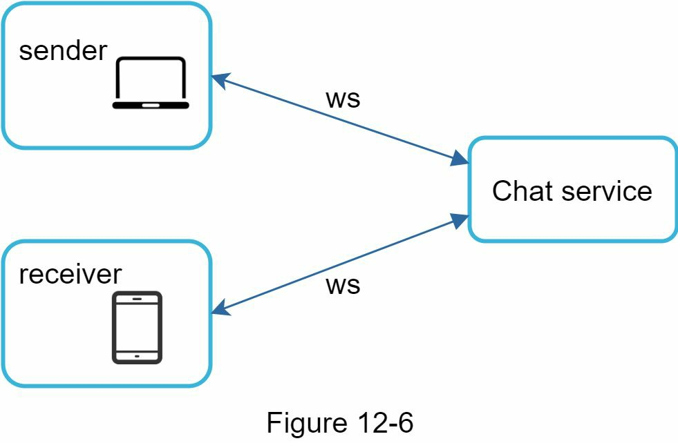
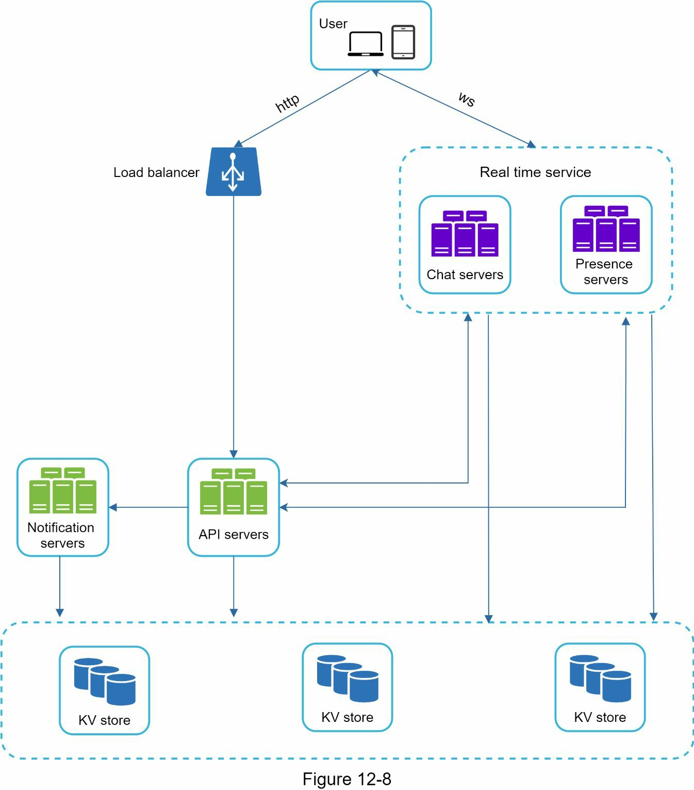
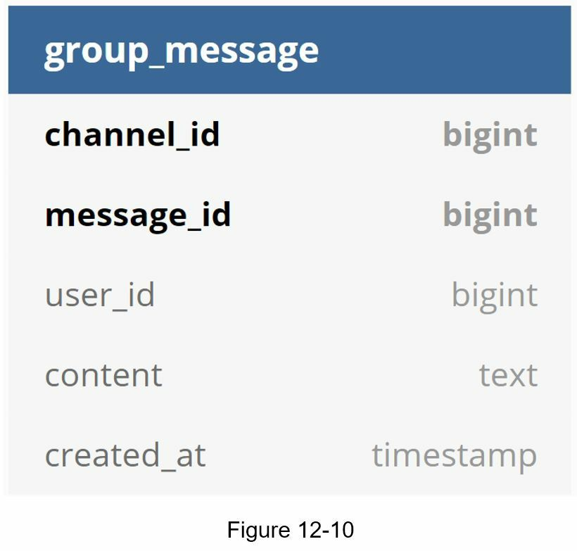

# Chapter 12: Design a chat system
- Design of a chat system
- Most popular apps in the marketplace

- Chat app
  - Perform different functions for differnt people
  - Important to nail down the exact requirements

## Step 1 - Understand the problem and establish design scope
### Possible questions and answers
- What kind of chat app shall we design? 1 on 1 or group based?
  - both
- Mobile app? Web app?
  - both
- What is the scale of this app?
  - Shoud support 50 million daily active users(DAU)
- For group chat, what is the gorup member limit?
  - A maximum 100 people
- What features are important for the chat app?
  - 1 on chat, group chat, online indicator, only support text message
- Message size limit?
  - Text length should be less than 100,000 characters long
- E2E encryption required?
  - No, but can discuss later
- How long shall we store the chat history?
  - Forever

### Design with follow feature
- One-on-one chat with low delivery latency
- Small group chat
- Online presence
- Multiple device support
- Push notification
- Support 50 million DAU

## Step 2 - Propose high-level design and get buy-in
- Client do not communicate directly with each other. Each client connects to a chat service.
- Chat service must support the following functions
  - Receive message from other clients
  - Find the right recipients for each message and relay the message to the recipients
  - If a recipient is not online, hold the messasges for that recipient on the server until she is online

- Client connects the chats service using one or more network protocol when it intends to start a chat.
- For a chat service, the choice of network protocols is important.
- Requests are initiated by the client for most client/server applications
  - Sender sends a message to the receiver via the chat service
  - Uses the time-tested HTTP protocol
  - Most common web protocol
  - The client opens a HTTP connection with the chat service and send the message
- Keep-alive 
  - Efficient for this because the keep-alive header allows a client to maintain a persistent connection with the chat service
  - Reduces the number of TCP handshakes
  - HTTP is a fine option on the sender side
- HTTP is more completed in the receier side
  - HTTP is client-initiated
  - Many techniques are used to simulate a server-initiated connection
  - Polling / long polling / Websocket

### Polling
- Technique that the client periodically asks the server if there are messages available. 
- Depending on polling frequency, polling could be costly
- It could consume precious server resources to answer a question that offers no as an answer most of them time. 

### Long polling
- Because polling could be inefficient, the next progressio is long polling

- A client holds the connection open until there are actually new messages available or a timeout threshold has been reached. 
- Long polling's few drawback
  - Sender and receiver may not connect to the same chat server. HTTP based servers are usually stateless. If you use round robin for load balancing, the server that receives the message might not have a long-polling with the client who receives the message
  - A server has no good way to tell if a client is disconnected
  - It is inefficien. 

### WebSocket
- Most common solution for sending asynchronous updates from server to client

- Websocket connection is initiated by the client. It is bi-directional and persistent. 
- It stars its life as a HTTP connection and could be "upgraded" via some well-defined handshakes to a Websocket connection. 
- Even works under a firewall environments since it use port 80 or 443 

- By using WebSocket for both sending and receiving, it simplifies the design and makes implementation on both client and server more straightforward. 
- Since WebSocket connections are persistent, efficient connection management is critifical on the server-side. 

### High-level design
- Everything else does not have to be WebSocket
  - Most features(sign up, login, user profile, etc) of a chat application could use the traditional request/response method over HTTP
- Three major categories of chat system
  - stateless services, stateful services, and third-party integration 

#### Stateless services
- Traditional public-facing request/response services
- Used to manage the login, signup, user profile, etc.
- Behind a load balancer whose job is to route requests to the correct services based on the request path
- Can be monolithic or individual microservics and can use services already exists in the market
  - Service discovery : To give the client a list of DNS host names of chat servers that the client could connect to

#### Stateful service
- The only stateful service is the chat service
- The service is stateful because each client maintinas a persistent network connection to a chat server
- A client normally does not switch to another chat servers as long as the server is still available.

#### Thrid-party integration
- Push notification is the most important third-party integration. 
  
#### Scalability
- On a small scale, all servies listed above could fit in one server
- Assume scenario
  - 1M concurrent users
  - Each user connection needs 10K of memory on the server
  - As a result, it only need about 10GB of memroy to hold all the connections on one box
- Single server design is a deal breaker due to many factors
  - The single point of failure is the biggest among them

#### Storage
- Data layer usually requires some effort to get it correct
- An important decision we must make is to device on the right type of database to use. 
  - NoSQL or RDBMS?
  - We will examine the data types and read/write patterns
- Two types of data
  - Generic data / user profile / setting / user friends list
    - RDBMS
    - Replication / sharding are common techniques to satisfy availability and scalability requirements
  - Chat history data
    - The amount of data is enormous for chat system
    - Facebook messenger and Whatsapp process 60 billions messages a day
    - Only recent chats are accessed frequently
    - But searching message is required for old data
- Selecting the correct storage system that supports all of our use cases is crucial, and Key-value stores is proper
  - KV stores allow easy horizontal scaling
  - KV stores provide very low latency to access data
  - RDBMS do not handle long tail of data well.

### Data models
#### Message table for 1 on 1 chat

- Message table for 1 on 1 chat
- The primary key is message_id, which helps to decide message sequence.
- Cannot rely on created_at to decide the message sequence because two message can be created at the same time

#### Message table for group chat

- The message table for group chat
- The composite primary key is (channel_id, message_id)
##### Message ID 
- Message_id carries the responsbility of ensuring the order of message
- To ascertain the order of message, message_id must satisfy the following two requirements
  - IDs must be unique
  - IDs should be sortable by time, meaning new rows have higher IDs than old ones
- How to achieve those two requirements?
  - auto_increment -> NoSQL does not provide this
  - To use global 64-bit sequence number generator
    - In Chat 7, it is discuessed
  - Local sequence number generator
    - Easy to impelment
    - It's enough to keep the order in group or one-on-one channel

## Step 3 - Design deep dive
- More deep dive for service discover / messaging flow/ online-offline indicator
### Service discovery
- The primary role of service discovery is to recommend the best chat server for a client based on the criteria like geographical location, server capacity, etc.
- Apach Zookeeper is a popular open-source solution for service discovery.
- It registers all the available chat servers and picks the best chat server for a client based on predefined criteria.

1. User A tries to login 
2. The load balancer sends the login requests to API servers
3. Service discover finds the best chat server for Uesr A and this info is returned back to User A
4. User A connects to chat server 2 through WebSocket

### Message flows
#### 1 on 1 chat flow

1. User A sends a chat message to Chat server 1
2. Chat server 1 obtains a message ID from the ID generator
3. Chat server 1 sends the message to the message sync queue
4. The message is stored in a key-value store
5. If user b is online, the message is forwared to Chat server 2 where user B is connected
6. If user b is offline, a push notification is sent from push notification(PN) servers. 
7. Chat server 2 forward the message to User B. There is a persistent WebSocket connection between User B and Chat server 2

#### Message synchronization across multiple devices
- How to sync message cross multiple devices

- User A has two deviecs
  - Whe User a logs in tothe chat app, it establishs a WebSocket connection with Chat server 1
  - Similarly, there is a connection between other apps and chat server 1
- Each device maintains a variable called cur_max_message_id, which keeps track fo the latest message ID on the device
- Messages that satisfy the following two conditions are considered as new messages
  - The recipient ID is equal to the currently logged-in user ID
  - Message ID in the key-value stored is larger than cur_max-message_id

#### Small group chat flow

- What happens when User A send a mesage in a group chat
- There are message queues for each users
- This is good design for small group chat
  - Simplifies message sync flow as each client only needs to check its own inbox to get new messages
  - When the group number is small, storing copy in each recipient's inbox is not too expensive

- On the recipient side
- In case for a recipient can receive messages from multiple users.

### Online presence
- Online presence indicator is an essential feature of many chat app
- Presence servers are responsible for managing online status and communicating with clients through WebSocket. 
- There are a few flows that will trigger online status change

#### User login
- After WebSocket connection is built between the client the real-time service, user A's online status and last-activate-at timestamp are saved in the KV stores

#### User logout
- The online status is chagned to offline in the KV store. 
- The presence indicator show a user is offline

#### User disconnectoin
- Should put the fact that unreliable status of internet connection
- When disconnects from the internet, the persistent connection between the client and server is lost
- A naive way to handle user disconnection
  - To mark the user as offline and change the status to online when the connection re-establishes
  - This has a major flaw
    - Depends on the stauts of internet, user status is changed a lot
    - Poor user experience
- Heartbeat mechanism
  - Periodically, online client sends a heartbeat event to presence servers
  - If presence receive a heartbeat event within a certain times, it is online, else offline

#### Online status fanout

- How do user A's friends know about the status change?
- Presence servers use a publish-subscribe model, in which each friend pair maintains a channel
- The communication between clients and servers is through real-time WebSocket

## Step 4 - Wrap up
- Addtional talking points
  - Extend the chat app to support media files like photo and videos
  - End-to-End encryption
  - Caching message on the client-side
  - Improve load time
  - Error handling