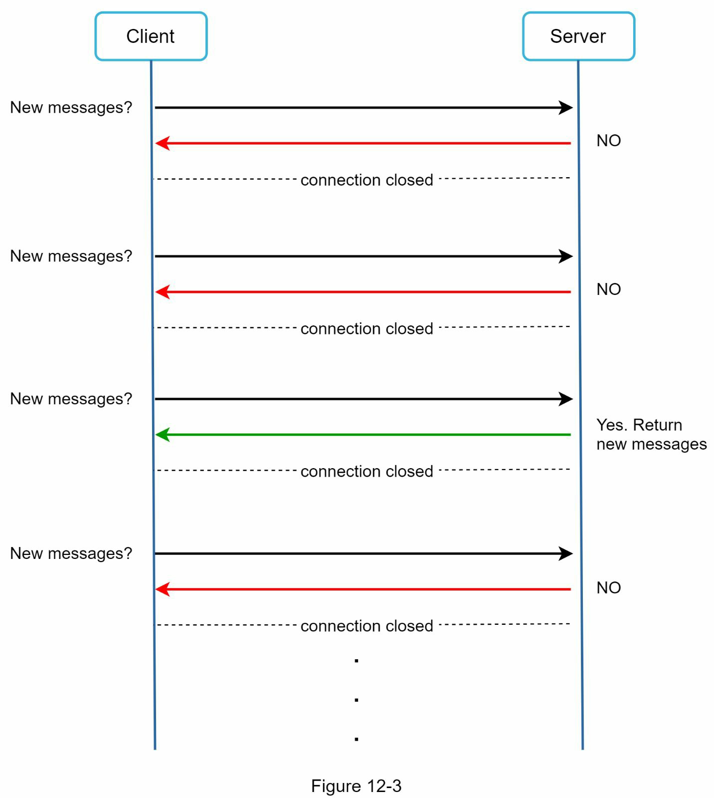
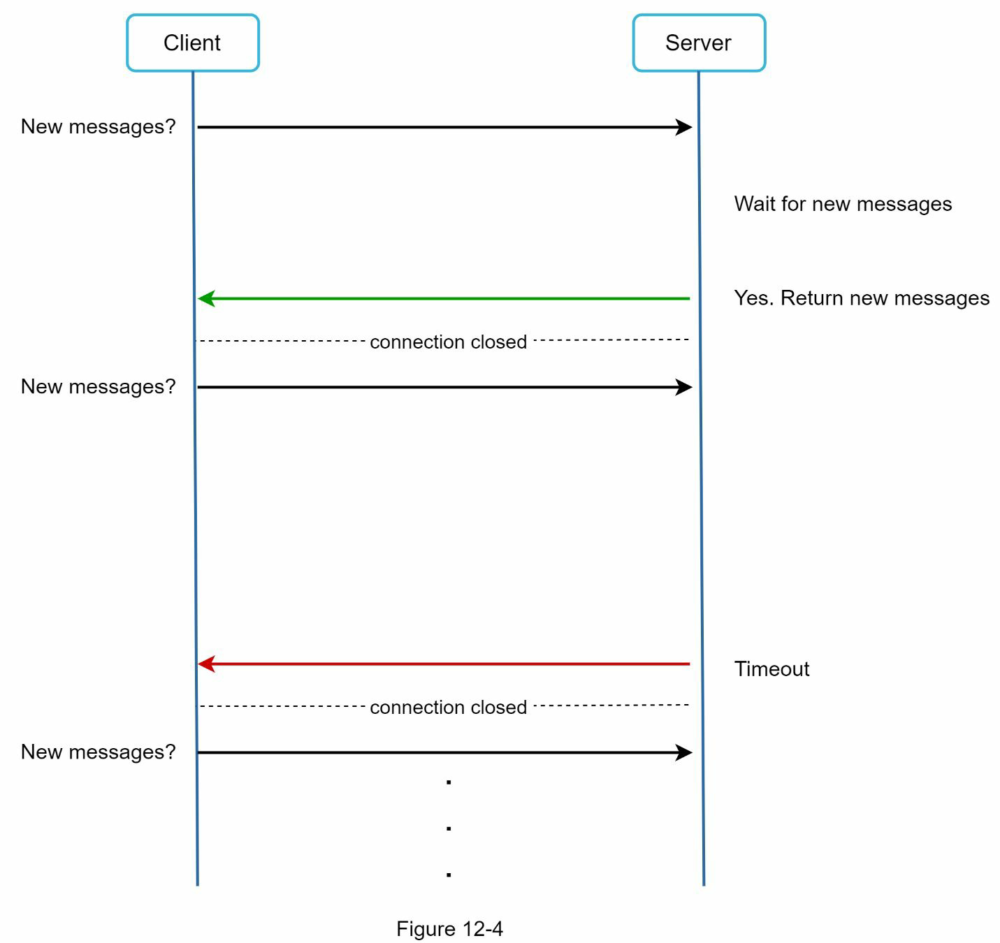
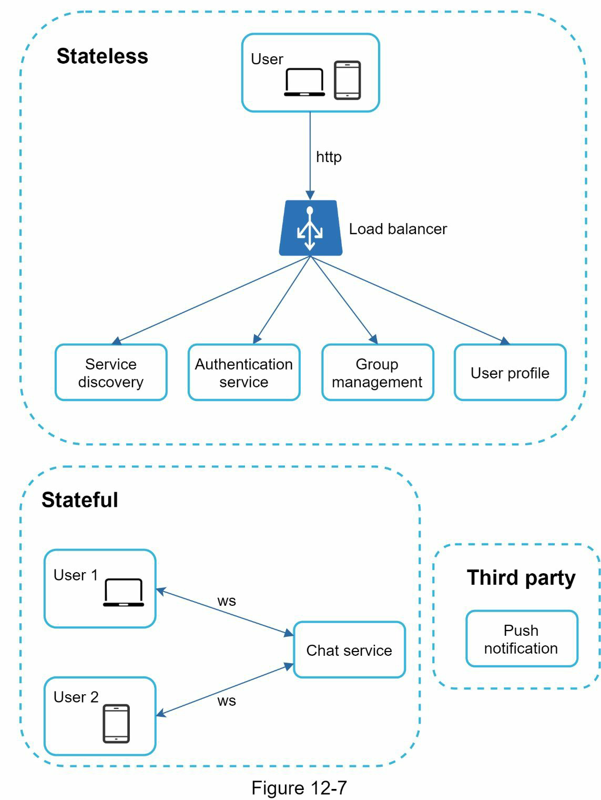
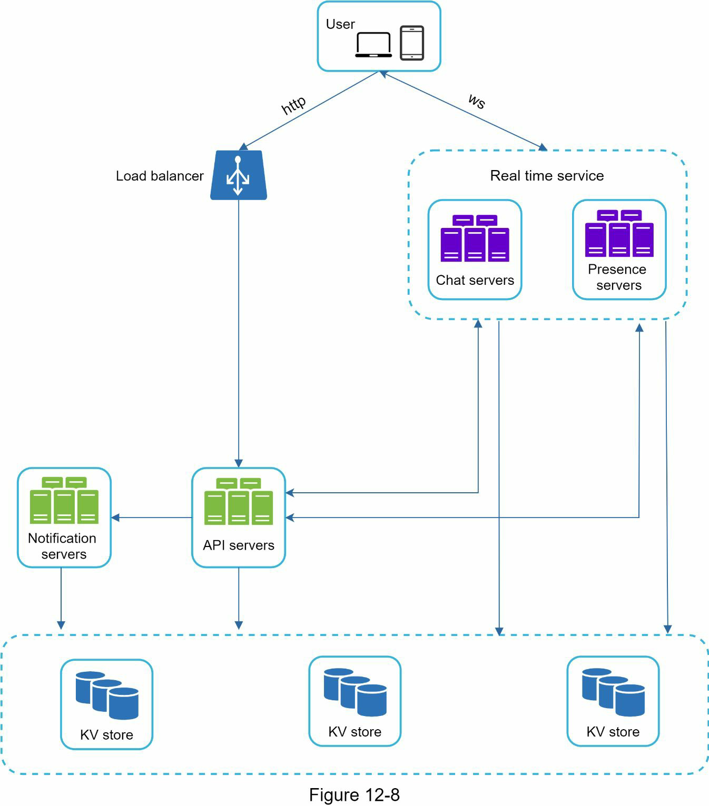
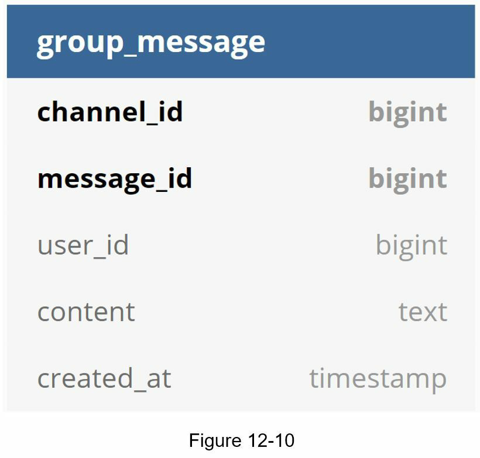
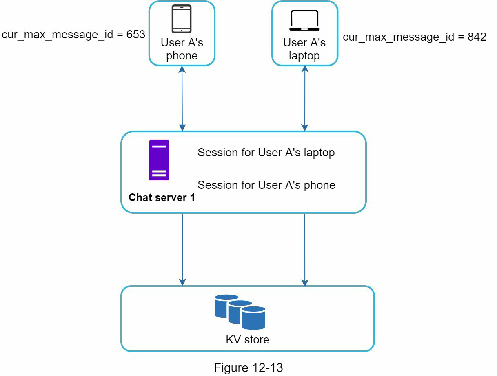
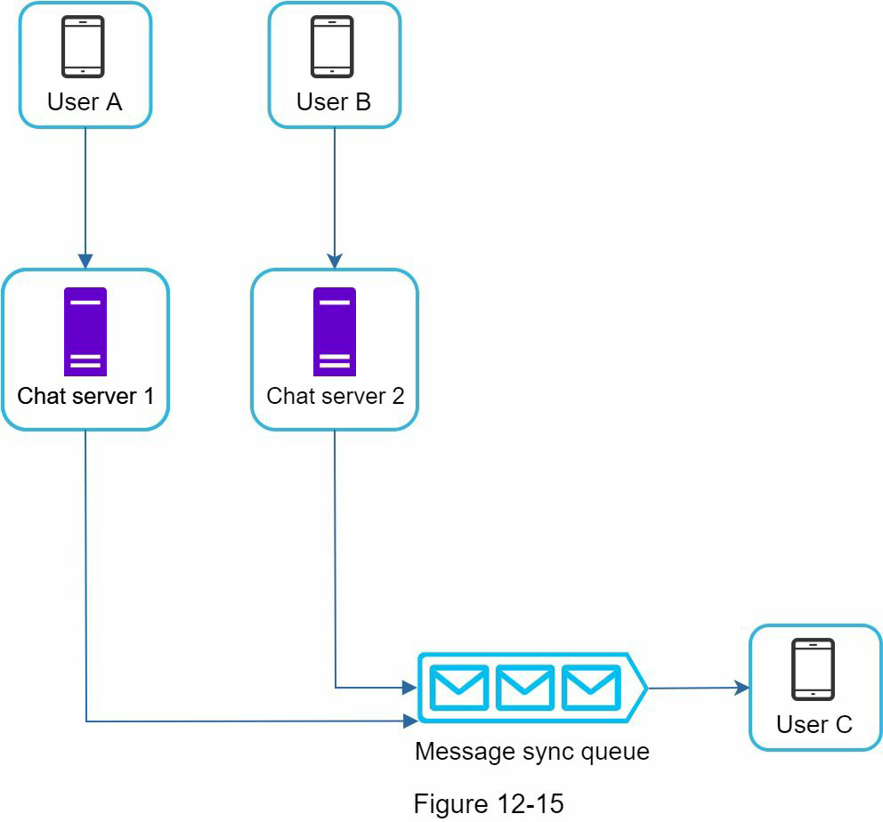
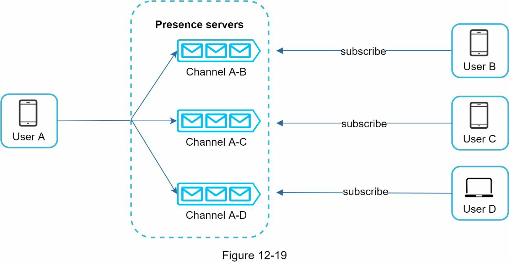

## CHAPTER 12: DESIGN A CHAT SYSTEM

### Step 1 - Understand the problem and establish design scope
Candidate: What kind of chat app shall we design? 1 on 1 or group based?
Interviewer: It should support both 1 on 1 and group chat

Candidate: Is this a mobile app? Or a web app? Or both?
Interviewer: Both.

Candidate: What is the scale of this app? A startup app or massive scale?
Interviewer: It should support 50 million daily active users (DAU).

Candidate: For group chat, what is the group member limit?
Interviewer: A maximum of 100 people

Candidate: What features are important for the chat app? Can it support attachment?
Interviewer: 1 on 1 chat, group chat, online indicator. The system only supports text messages.

Candidate: Is there a message size limit?
Interviewer: Yes, text length should be less than 100,000 characters long.

Candidate: Is end-to-end encryption required?
Interviewer: Not required for now but we will discuss that if time allows.

Candidate: How long shall we store the chat history?
Interviewer: Forever.

- A one-on-one chat with low delivery latency
- Small group chat (max of 100 people)
- Online presence
- Multiple device support. The same account can be logged in to multiple accounts at the same time.
 Push notifications

 ### Step 2 - Propose high-level design and get buy-in
 The chat service must support the following functions:
- Receive messages from other clients.
- Find the right recipients for each message and relay the message to the recipients. 
- If a recipient is not online, hold the messages for that recipient on the server until she is online.
 
 Protocol : Time tested HTTP protocol. 
 Keep alive header for the persistent connection and to reduce the number of TCP handshake

 ##### Polling 
  

 ##### Long Polling
 In long polling, a client holds the connection open until there are actually new messages available or a timeout threshold has been reached.
 

 Drawbacks
 • Sender and receiver may not connect to the same chat server. HTTP based servers are usually stateless. If you use round robin for load balancing, the server that receives the message might not have a long-polling connection with the client who receives the message.
• A server has no good way to tell if a client is disconnected.
• It is inefficient. If a user does not chat much, long polling still makes periodic
connections after timeouts.

##### Web Socket
Web Socket connection is bi-directional and persistent

#### HLD

 
##### Stateless Services
Login, signup, user profile

##### Stateful Service
Chat service

##### Third-party integration
Push notification

- Chat servers facilitate message sending/receiving.
- Presence servers manage online/offline status.
- API servers handle everything including user login, signup, change profile, etc.
- Notification servers send push notifications.
- Finally, the key-value store is used to store chat history. When an offline user comes online, she will see all her previous chat history.

##### Storage
Two types of data exist in a typical chat system. The first is generic data, such as user profile, setting, user friends list. These data are stored in robust and reliable relational databases. 0Replication and sharding are common techniques to satisfy availability and scalability requirements.

- The amount of data is enormous for chat systems. A previous study [2] reveals that Facebook messenger and Whatsapp process 60 billion messages a day.
- Only recent chats are accessed frequently. Users do not usually look up for old chats.
- Although very recent chat history is viewed in most cases, users might use features that require random access of data, such as search, view your mentions, jump to specific
messages, etc. These cases should be supported by the data access layer.
- The read to write ratio is about 1:1 for 1 on 1 chat apps.

- Key-value stores allow easy horizontal scaling.
- Key-value stores provide very low latency to access data.
- Relational databases do not handle long tail [3] of data well. When the indexes grow large, random access is expensive.
- Key-value stores are adopted by other proven reliable chat applications. For example, both Facebook messenger and Discord use key-value stores. Facebook messenger uses
HBase [4], and Discord uses Cassandra [5].

#### Data Models
##### Message table for 1 on 1 chat

##### Message table for group chat

• IDs must be unique.
• IDs should be sortable by time, meaning new rows have higher IDs than old ones.
- Use global 64-bit sequence number generator like Snowflake

### Step 3 - Design deep dive

#### Service discovery
The primary role of service discovery is to recommend the best chat server for a client based on the criteria like geographical location, server capacity, etc

1. User A tries to log in to the app.
2. The load balancer sends the login request to API servers.
3. After the backend authenticates the user, service discovery finds the best chat server for
User A. In this example, server 2 is chosen and the server info is returned back to User A.
4. User A connects to chat server 2 through WebSocket.

#### Message flows
##### 1 on 1 chat flow

##### Message synchronization across multiple devices

In Figure 12-13, user A has two devices: a phone and a laptop. When User A logs in to the chat app with her phone, it establishes a WebSocket connection with Chat server 1. Similarly, there is a connection between the laptop and Chat server 1. Each device maintains a variable called cur_max_message_id, which keeps track of the latest message ID on the device. Messages that satisfy the following two conditions are considered as news messages:
• The recipient ID is equal to the currently logged-in user ID.
• Message ID in the key-value store is larger than cur_max_message_id .
With distinct cur_max_message_id on each device, message synchronization is easy as each
device can get new messages from the KV store.

##### Small group chat flow

##### Online presence
###### User login

###### User logout

###### User disconnection

###### Online status fanout

### Step 4 - Wrap up
If you have extra time at the end of the interview, here are additional talking points:
• Extend the chat app to support media files such as photos and videos. Media files are
significantly larger than text in size. Compression, cloud storage, and thumbnails are
interesting topics to talk about.
• End-to-end encryption. Whatsapp supports end-to-end encryption for messages. Only the
sender and the recipient can read messages. Interested readers should refer to the article in the reference materials.
• Caching messages on the client-side is effective to reduce the data transfer between the client and server.
• Improve load time. Slack built a eographically distributed network to cache users’ data, channels, etc. for better load time.
• Error handling.
• The chat server error. There might be hundreds of thousands, or even more persistent connections to a chat server. If a chat server goes offline, service discovery (Zookeeper) will provide a new chat server for clients to establish new connections with.
• Message resent mechanism. Retry and queueing are common techniques for resending messages.
